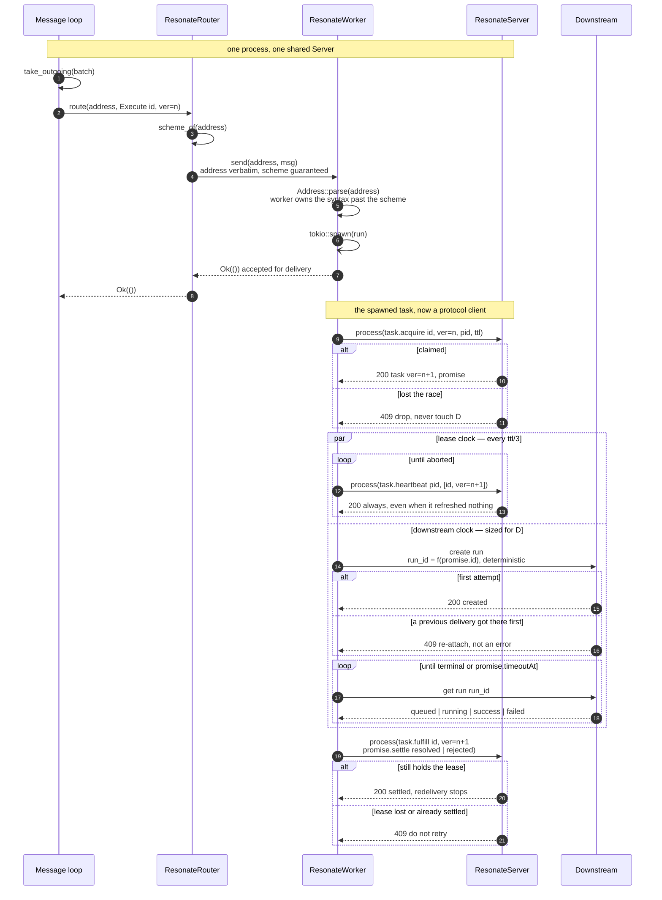
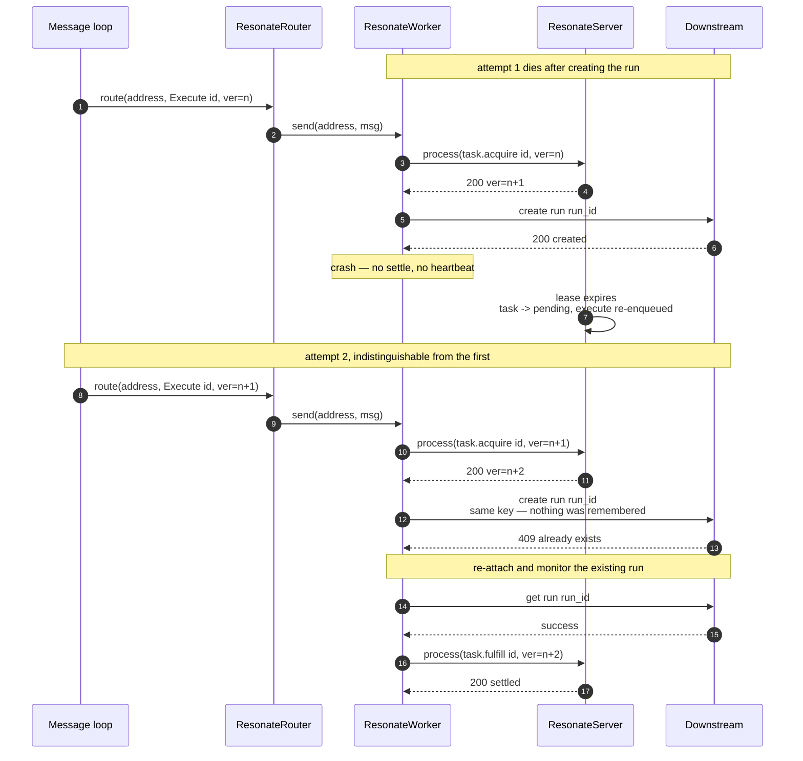

# The contract

Everything here comes from `src/core/` (the ports), `src/transport/mod.rs` (the router),
`src/processing/processing_messages.rs` (dispatch), and
`src/persistence/persistence_sqlite.rs` (retry and lease semantics).

## The ports

`src/core/` depends on nothing else in the crate. Every other module is an adapter that
depends on it, and nothing below `core` may `use crate::{server, transport, persistence,
oracle}`.

### `ResonateServer` — the inbound port

```rust
#[async_trait]
pub trait ResonateServer: Send + Sync {
    /// Apply one request and return its response.
    ///
    /// A non-2xx outcome is still a completed exchange: it comes back as `Ok`
    /// with the status in `ResponseHead::status`. `Err` is reserved for "there
    /// is no answer".
    async fn process(&self, req: &RequestEnvelope) -> Result<ResponseEnvelope, Unavailable>;
}
```

One request in, one response out. The in-process server, the in-memory reference model, and
a client for a remote server all satisfy it, so callers are written once and pointed at any
of them.

`process` resolves the effective `now` from `head.debug_time` — there is deliberately no
`now` parameter, which is what keeps the trait a pure function of its input.
Authentication, metrics and tracing are about the *caller*, not the request, and live
outside in the hosting adapter.

Not yet the full protocol boundary: envelope validation (empty `kind`, non-object `data`,
unsupported `head.version`) still lives in the HTTP adapter, so an in-process caller
reaches the operations without those checks. Do not rely on `process` rejecting a malformed
envelope.

### `ResonateWorker` — the outbound port

```rust
#[async_trait]
pub trait ResonateWorker: Send + Sync {
    /// Deliver one message to the worker at `address`.
    ///
    /// The router guarantees only that `address` carries this worker's
    /// registered scheme; everything past the scheme is this worker's to
    /// parse and to reject.
    async fn send(&self, address: &str, msg: &Message) -> Result<(), Unavailable>;
}
```

`Send + Sync` because the router holds it as `Arc<dyn ResonateWorker>` and calls it from
whichever task is draining the outgoing queue. `&self`, not `&mut self`: one worker
instance serves every address of its scheme concurrently, so any mutable state it keeps
needs its own synchronisation.

The dual of `ResonateServer`: a server receives requests and returns responses; a worker
receives messages and — for the ones that do real work — issues requests back at a server.

Most implementations are **proxies** for a worker running elsewhere: HTTP push, poll/SSE
and Pub/Sub each hand the message off and return. `bash` and `airflow` are real workers
running in process. So:

> `send` means **accepted for delivery**, not **executed**. A worker that happens to run to
> completion synchronously is a special case, not the contract.

An integration therefore validates what it can cheaply (the address, the deployment
lookup), spawns the long work, and returns `Ok(())`.

The address arrives **unparsed**, on purpose. The router guarantees only that the address
carries this worker's registered scheme; everything past the scheme is the worker's to
parse and to reject.

### `ResonateRouter` — scheme to worker

```rust
#[async_trait]
pub trait ResonateRouter: Send + Sync {
    /// Route and deliver one message.
    ///
    /// Returns `Err(Unavailable)` when the message could not be handed off:
    /// the address does not parse as a URL, no worker is registered for its
    /// scheme, or the worker itself was unreachable.
    async fn route(&self, address: &str, msg: &Message) -> Result<(), Unavailable>;
}
```

`TransportDispatcher` is a `HashMap<String, Arc<dyn ResonateWorker>>`. It reads the scheme,
looks up a worker, and hands over the untouched address. `Err(Unavailable)` covers three
cases: the address is not a URI, no worker is registered for its scheme, or the worker was
unreachable.

The dispatch loop logs and drops on all three. The message has already been dequeued, so
the task stays pending and the retry loop produces another `execute` within
`tasks.retry_timeout`. **An unregistered scheme costs latency, never correctness.**

## The in-process sequence

How a message becomes a settled promise, in the shape the protocol docs use.



Four things the diagram is about:

- **Steps 6–8 are the point of the port.** `send` spawns and returns `Ok(())` before any
  work happens, so the dispatch loop is not blocked for the hours a downstream run may take.
- **Step 9 reverses direction.** The worker becomes a client of the same `ResonateServer`
  the message came from. The worker holds `Arc<dyn ResonateServer>` and `Server` never
  holds the router, so it stays a DAG rather than a cycle.
- **The `par` block is two independent clocks** — steps 12–13 against the lease, steps
  14–18 against the downstream system. Neither branch knows the other's cadence.
- **Nothing in the diagram tells the worker which delivery this is.** The `Execute` at step
  2 is identical on attempt one and attempt five. That is why step 16 — a `409` from the
  downstream create — means *success*, while the `409` at step 21, from `task.fulfill`,
  means this attempt no longer owns the task.

### Redelivery



## `Unavailable` — the only error

```rust
pub struct Unavailable { pub message: String }
```

Everything the peer can say about a request — not found, conflict, forbidden, internal
error — is an **in-band** outcome in `ResponseHead::status`. `Unavailable` means the
exchange did not complete.

**The retry contract is the important half:**

> The caller must assume the request *may already have been applied*. A connection refused
> before the first byte and a timeout after the last are both `Unavailable` and the caller
> cannot tell them apart, so retries must be idempotent.

That sentence is why an integration cannot be built on a downstream system that will not
deduplicate a create. `Unavailable` never crosses the wire; at the HTTP edge it renders as
a 503.

## Addresses

```rust
pub fn is_valid_address(address: &str) -> bool   // parses as a URI with a scheme
pub fn scheme_of(address: &str) -> Option<String>
```

Validity is deliberately shallow, and the shallowness is a requirement rather than a
simplification:

- Validation has to be a **pure function of the string**, identical on every deployment,
  because the reference model has no workers at all.
- A server's **enabled transports must never change which requests it accepts**. A
  scheme-aware check would make both untrue.

The consequence: `airflow://prod/dags` is accepted at `promise.create` and rejected at
delivery, by the Airflow worker. Design for that — a malformed address must produce a
clear, non-retrying failure in the worker, not a silent drop.

It also means an integration **does** own its own scheme. Registering `"airflow"` in the
router is all it takes; nothing in `core` changes.

## Messages

```rust
pub enum Message {          // untagged: each variant carries its own `kind`
    Execute(ExecuteMsg),    // { kind, head: { serverUrl }, data: { task: { id, version } } }
    Unblock(UnblockMsg),    // { kind, head: {}, data: { promise: PromiseRecord } }
}
```

- `data.task.id` **is also the promise id**. Task, promise and settlement are keyed on the
  same string.
- `data.task.version` is a fencing token for `task.acquire`, not an attempt counter.
- An integration acts on `Execute` and returns `Ok(())` for `Unblock` — an unblock is a
  notification for a worker that is *waiting* on a promise, which an integration never is.

## Delivery and retry semantics

1. A promise carrying `resonate:target` gets a task in `pending` and an `execute` enqueued.
2. **While the task stays pending, the server re-enqueues `execute` every
   `tasks.retry_timeout` (default 30 000 ms), forever.**
3. `task.acquire` moves it to `acquired`, bumps `version`, and starts a lease of `ttl` ms.
   While leased and heartbeated, no `execute` is re-sent.
4. **A lease expiry drops the task back to `pending` and enqueues an `execute`
   immediately.**
5. Redelivery stops only when the promise settles — by the worker, by a direct
   `promise.settle`, or by the timeout loop.

Consequences an integration must be built around:

- The same `execute` arrives many times for one promise, across process restarts.
- `task.acquire` is the mutual-exclusion gate between *concurrent* attempts: exactly one
  acquire per version succeeds, the rest get `409`. It is **not** protection against a
  *previous* attempt that already fired a downstream request and then died.
- Idempotency must therefore live in the downstream system.

## Task state machine

```
                 promise.create (with resonate:target)
                                │
                                ▼
        ┌──────────────────► pending ◄───────────────────┐
        │                       │                        │
        │              task.acquire(id, version)         │ lease expiry
        │                       ▼                        │ task.release
        │                   acquired ────────────────────┘
        │                    │     │
        │  task.suspend      │     │  task.fulfill
        │                    ▼     ▼
        └──────────────── suspended  fulfilled  ◄── promise settled by anyone
                (awaited promise settles → pending + execute)
```

`halted` also exists (`task.halt` / `task.continue`) and integrations do not use it.

## Protocol calls an integration makes

All through `server.process(&RequestEnvelope { kind, head, data })` with
`head.version = PROTOCOL_VERSION` and a fresh `corr_id`. The response's real status is
`head.status`; `Err` is only `Unavailable`.

### `task.acquire`

```json
{ "id": "<task id>", "version": <from execute>, "pid": "<worker instance>", "ttl": 30000 }
```

`200` returns `TaskAcquireResponseData { task, promise, preload }`. **Use
`task.version` from the response** for every later call — it is the request version plus
one. `409` means another attempt owns it: drop silently. `promise.param`,
`promise.created_at` and `promise.timeout_at` are the integration's entire input, and the
latter two are stable across retries.

### `task.heartbeat`

```json
{ "pid": "<same pid>", "tasks": [ { "id": "…", "version": <acquired version> } ] }
```

Every `ttl / 3` — a cadence derived from the lease and from nothing else. Batching is
allowed but every task in a batch must share the same origin (the substring before the
first `:`), so one task per request is the always-correct choice.

**It always answers `200`.** The storage update is guarded on `state = 'acquired'` at the
right version and pid; when the guard fails it updates zero rows and the handler still
returns `200 {}`. So a heartbeat is fire-and-forget by protocol design and a worker cannot
use it to detect that it lost its lease — that surfaces at `task.fulfill`, as a `409`.

### `task.fulfill`

```json
{ "id": "<task id>", "version": <acquired>,
  "action": { "kind": "promise.settle", "head": {},
              "data": { "id": "<task id>", "state": "resolved",
                        "value": { "headers": {"content-type": "application/json"},
                                   "data": "<base64 utf-8 json>" } } } }
```

`action.data.id` **must equal** `id` or the request is rejected `400`. `409` means the lease
was lost or the promise already settled — usually a timeout. Never retry a `409` fulfill.

### `task.release`

`{ "id": "…", "version": <acquired> }` — back to `pending`, re-dispatched after
`retry_timeout`.

### `promise.create` / `promise.get` / `promise.search`

`promise.create` is idempotent by id. A promise tagged `resonate:timer: "true"` **resolves**
(rather than rejecting) at its `timeoutAt` — the durable sleep primitive, used by the
scale-out monitoring shape in `lifecycle.md`. `promise.search` filters on tags, so tagging
integration promises makes them findable for ops tooling.

## Status codes

| Status | Meaning |
|---|---|
| `200` | Success |
| `300` | `task.suspend` only: awaited promise already settled, resume now |
| `400` | Malformed or invalid request |
| `403` | Unauthorized |
| `404` | Task or promise not found |
| `409` | Version mismatch or wrong state — you no longer own this task |
| `422` | `task.suspend` only: awaited promise does not exist |
| `500` | Server/storage error |
