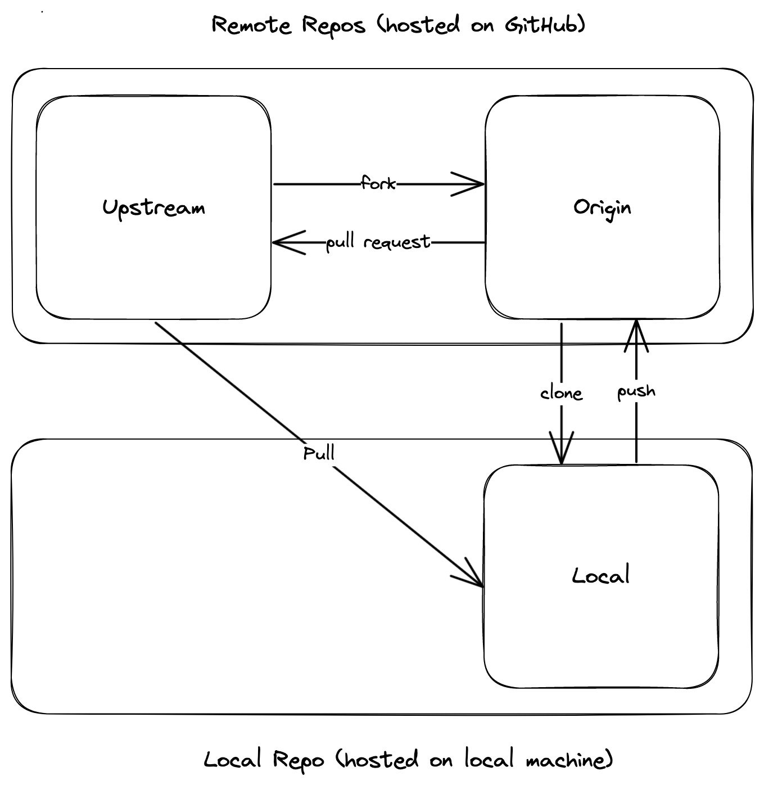

# How to Contribute

Welcome to the Resonate project! We appreciate your interest in helping us build reliable 
and scalable distributed systems. To get started, follow these simple steps:

## Initial setup

We follow the fork and branch workflow. There will be three Git repositories involved:

1.  *upstream* - the [resonate](https://github.com/resonatehq/resonate) repository on GitHub.
2.  *origin* - your GitHub fork of `upstream`. 
3.  *local* - your local clone of `origin`. 

These steps are only needed once and not for subsequent changes you might want to make:

1. Fork the `resonate` repository on GitHub to create `origin`.
   Visit [resonate](https://github.com/resonatehq/resonate) GitHub repository and click the `Fork` button.

2. Make a `local` clone of your fork.

    ```shell
    git clone git@github.com:<your-user-name>/resonate.git
    ```

3. Add a remote pointing from `local` to `upstream`.

    ```shell
    cd resonate
    git remote add upstream git@github.com:resonatehq/resonate.git
    ```
4. Double check the two remotes are referencing the expected url.

    ```shell
    git remote get-url origin   # git@github.com:<your-user-name>/resonate.git
    git remote get-url upstream # git@github.com:resonatehq/resonate.git
    ```

## Development workflow

<p align="center">
    
</p>

Here is a outline of the steps needed to make changes to the resonate
project.


1. Make a local branch in your clone and pull any recent changes into it.

   ```shell
   git switch -c awesome_branch  
   git pull upstream main
   ```

2. Make changes and commit to local branch.

   ```shell
   git add .
   git commit -m "dead simple"
   ```

3. Pull any changes that may have been made in the upstream repository
   main branch.

   ```shell
   git pull --rebase upstream main # may result in merge conflicts
   ```

4. Push your branch to the corresponding branch in your fork.

   ```shell
   git push origin awesome_branch
   ```

5. Select the branch you are working on in the drop-down menu of branches in
   your fork. Then hit the `Compare and pull request` button.

6. Once your pull request has been reviewed and approved by a maintainer, select 
   the `Squash and merge` option. Edit the commit message as appropriate for the 
   squashed commit.

7. Delete the branch from `origin`:

    ```
    git push origin --delete awesome_branch
    ```

8. Delete the branch from `local`:

    ```
    git switch main
    git branch -D awesome_branch
    ```

## Working with Nix

This repo currently has some optional [Nix] stuff that you can experiment with.

### Getting started

To get started, [install Nix][nix-install] on either Linux or macOS (the install script infers which system you're on):

```bash
curl --proto '=https' --tlsv1.2 -sSf -L https://install.determinate.systems/nix | sh -s -- install
```

This could take a few minutes.
If you need to cleanly uninstall Nix and all of its system dependencies at any time:

```bash
/nix/nix-installer uninstall
```

### The development environment

Once Nix is on your system, you can activate the Nix [development environment][dev-env] in this repo:

```bash
nix develop
```

With that command, you enter a project-specific shell with pinned packages for all of the tools required for the project (Go 1.21, protoc plus plugins, etc.).
All the `make` commands in the [`Makefile`](./Makefile), for example, should just work inside the shell.

In order to [streamline][nix-direnv-post] activating the development shell, it's recommended to [install direnv][direnv-install].
If you install [direnv] and run `direnv allow` in this repo, the Nix development shell will be activated automatically every time you `cd` into the repo, which makes explicitly running `nix develop` unnecessary.
If you'd like to disable direnv in this repo, you can run `direnv revoke`.

Optionally, you can install [nix-direnv] in addition to [direnv].
nix-direnv provides a faster implementation of direnv's Nix functionality (though direnv should work just fine in this repo without it).

### Building the server as a package

In addition to the development environment, you can build the Resonate server as a Nix package:

```bash
nix build
```

When that succeeds, the binary will be available at `./result/bin/resonate`:

```bash
./result/bin/resonate serve
```

`result` is actually a symlink to a Nix store path:

```bash
realpath result
/nix/store/xmjcz2rm3l8k8wjnvm4yk7m8fkp59apj-resonate-0.5.0 # the hash will differ on your system
```

In order to handle Go dependencies, this project uses a tool called [gomod2nix].
What this tool essentially does is inspect [`go.mod`](./go.mod) and generate a [`gomod2nix.toml`](./gomod2nix.toml) file that Nix can use to generate [derivations] for each Go dependency.

Whenever you update the `go.mod` file, you need to run `gomod2nix` (included in the Nix development environment) to regenerate `gomod2nix.toml`.
If you update `go.mod` but forget to regenerate `gomod2nix.toml`, the [`Ensure gomod2nix dependencies are up to date`](./.github/workflows/cicd.yaml) job will fail in CI.

### Running the server directly using Nix

As an alternative, you can run the server directly using Nix:

```bash
nix run

# To pass in args
nix run . -- serve
```

### Building the Docker image with Nix

For x64 Linux users, you can even build the Resonate Docker image using Nix (with no dependence on the `Dockerfile` or the Docker CLI):

```bash
nix build .#dockerImages.x86_64-linux.default
```

To load the image:

```bash
docker load < result
```

## What to contribute to?

Here are some areas where your contributions would be valuable:

* Bug fixes for existing packages.
* Refactoring efforts to improve code quality.
* Enhancements to our testing and reliability efforts.
* Add support for the following databases: MySQL, Elasticsearch, MongoDB.

Thank you for your contributions and support in building a better Resonate! 🚀

[derivations]: https://zero-to-nix.com/concepts/derivations
[dev-env]: https://zero-to-nix.com/concepts/dev-env
[direnv]: https://direnv.net
[direnv-install]: https://direnv.net/docs/installation.html
[gomod2nix]: https://github.com/nix-community/gomod2nix
[nix]: https://nixos.org
[nix-direnv]: https://github.com/nix-community/nix-direnv
[nix-direnv-post]: https://determinate.systems/posts/nix-direnv
[nix-install]: https://zero-to-nix.com/start/install
