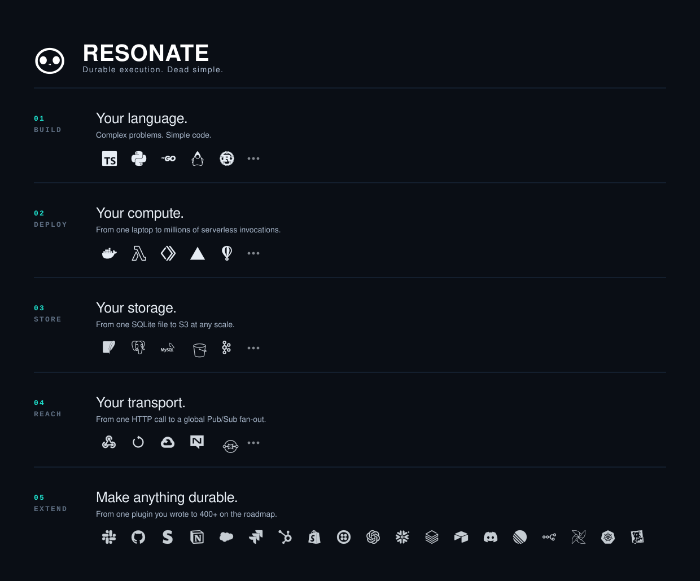

<div align="center">


# Resonate Server

### Distributed async await. One binary. Absolute orchestration powerhouse.

**Write ordinary functions. Get durable, distributed execution that survives crashes, restarts, and everything else.**

[](./LICENSE)
[](https://www.rust-lang.org/)
[](https://resonatehq.io/discord)
[](https://docs.resonatehq.io/)

[Quickstart](#quickstart) · [Architecture](#architecture) · [Backends](#backends) · [Workers](#workers) · [Plugins](#plugins) · [Deploy](#deploy) · [Docs](https://docs.resonatehq.io/)

</div>

---

## What is this?

The Resonate Server is a single, highly efficient binary that pairs with a Resonate SDK to bring **durable execution** to your application. It is both supervisor and orchestrator for your workers, persisting execution state so long-running functions always run to completion.

No DAGs. No YAML. No new language. You write a function; Resonate makes sure it finishes.

```typescript
function* countdown(context: Context, count: number, delay: number) {
  for (let i = count; i > 0; i--) {
    yield* context.run((context: Context) => console.log(`Countdown: ${i}`));
    yield* context.sleep(delay * 1000);   // minutes, hours, or days — survives restarts
  }
  console.log("Done!");
}
```

---

## Architecture



One server in the middle. Your database underneath, your workers wherever they live, and a plugin for every system you need to reach.

---

## Why Resonate

|  | |
|---|---|
| **Durable by construction** | Promises, tasks, and schedules are persisted before they are acted on. A crash mid-flight is a resume, not a loss. |
| **Formally specified** | The protocol has a machine-checked specification in [resonate-specification](https://github.com/resonatehq/resonate-specification), with mechanized invariants — not a prose document that drifted. |
| **Differentially tested** | Every storage engine is compared step-for-step against an executable oracle on randomized traffic, across SQLite, PostgreSQL, and MySQL, with a snapshot diff after every request. |
| **One binary** | `brew install`, `resonate serve`, done. No control plane to operate, no cluster to bootstrap. |
| **Boring where it counts** | Your existing database is the state store. Your existing observability stack gets Prometheus metrics and OpenTelemetry traces. |

---

## Quickstart


**1. Install the server & CLI**

```shell
brew install resonatehq/tap/resonate
```

**2. Install an SDK**

```shell
npm install @resonatehq/sdk
```

**3. Write a durable function** — `countdown.ts`

```typescript
import { Resonate, type Context } from "@resonatehq/sdk";

function* countdown(context: Context, count: number, delay: number) {
  for (let i = count; i > 0; i--) {
    // Run a function, persist its result
    yield* context.run((context: Context) => console.log(`Countdown: ${i}`));
    // Sleep
    yield* context.sleep(delay * 1000);
  }
  console.log("Done!");
}

const resonate = new Resonate({ url: "http://localhost:8001" });
resonate.register(countdown);
```

[Working example →](https://github.com/resonatehq-examples/example-quickstart-ts)

**4. Start the server, then the worker**

```shell
resonate serve
npx ts-node countdown.ts
```

**5. Activate the function**

```shell
resonate invoke countdown.1 --func countdown --arg 5 --arg 60
```

```
Countdown: 5
Countdown: 4
Countdown: 3
Countdown: 2
Countdown: 1
Done!
```

Kill the worker halfway through. Start it again. The countdown picks up where it left off.

---

## Backends

Resonate keeps its state in a database you already run.

| Backend | Best for | Configure |
|---|---|---|
| **SQLite** | local development, single-node deployments | default — `resonate serve` |
| **PostgreSQL** | the production default | `RESONATE_STORAGE__TYPE=postgres` |
| **MySQL** | wherever it already runs | `RESONATE_STORAGE__TYPE=mysql` |

All three are held to the same behaviour by the differential test suite — the same requests go to every engine and to an executable model of the specification, and any divergence fails the build.

---

## Workers

A worker is your code. Resonate does not care where it runs.

- **In-process** — embed the SDK in your application and let it serve its own executions.
- **Out-of-process** — run a fleet of workers with their own lifecycle, scaled independently.

Resonate reaches them however suits your network:

| Transport | Shape |
|---|---|
| **HTTP push** | Resonate calls your endpoint. Ideal for Cloud Run, Cloud Functions, and anything with a URL. |
| **HTTP long-poll** | Your worker holds a connection open. Ideal behind NAT, in a laptop, or in a private cluster. |
| **Google Cloud Pub/Sub** | Resonate publishes; your subscribers pick up the work. |

---

## Plugins

A plugin represents an **external system's unit of work** — anything with a beginning and an end — as a durable promise. The plugin begins the work, sees it through to its terminal state, and settles the promise with the outcome.

The [catalogue](https://github.com/resonatehq/resonate-plugins/blob/main/Plugins.md) lists **447** systems on the roadmap. Seven are built today: Apache Airflow, Bannerbear, Baserow, Gotify, n8n, Rundeck, and Zendesk.

→ [resonatehq/resonate-plugins](https://github.com/resonatehq/resonate-plugins)

---

## SDKs

| Language | Repository |
|---|---|
| TypeScript | [resonate-sdk-ts](https://github.com/resonatehq/resonate-sdk-ts) |
| Python | [resonate-sdk-py](https://github.com/resonatehq/resonate-sdk-py) |
| Go | [resonate-sdk-go](https://github.com/resonatehq/resonate-sdk-go) |
| Java | [resonate-sdk-java](https://github.com/resonatehq/resonate-sdk-java) |
| Rust | [resonate-sdk-rs](https://github.com/resonatehq/resonate-sdk-rs) |

---

## Deploy

For the full guide see [Set up and run a Resonate Server](https://docs.resonatehq.io/operate/run-server).

### Homebrew

```shell
brew install resonatehq/tap/resonate
resonate serve
```

Every release and its artifacts are on the [releases page](https://github.com/resonatehq/resonate/releases).

On start you will see:

```shell
INFO resonate: Resonate Server starting port=8001
INFO resonate: Using SQLite backend path=resonate.db
INFO resonate: SQLite initialized
INFO resonate: Metrics server listening port=9090
INFO resonate: Server listening bind=0.0.0.0 port=8001
```

HTTP on `8001`, metrics on `9090`. These are the defaults every SDK assumes, and both are configurable.

### Docker

```shell
git clone https://github.com/resonatehq/resonate
cd resonate
docker-compose up
```

### From source

```shell
git clone https://github.com/resonatehq/resonate
cd resonate
cargo build --release
./target/release/resonate serve
```

---

## Configuration

Configuration comes from a TOML file, environment variables (`RESONATE_` prefix, `__` for nesting), or CLI flags — in that order of increasing precedence.

```shell
RESONATE_SERVER__PORT=3000
RESONATE_STORAGE__TYPE=postgres
RESONATE_STORAGE__POSTGRES__URL=postgres://...
```

### Outbound authentication for HTTP push

When Resonate delivers execute messages to protected Cloud Functions or Cloud Run services, it can attach an outbound authentication header. Configure it under `[transports.http_push.auth]`.

**Google Cloud ID token** (recommended for Cloud Run / Cloud Functions)

```toml
[transports.http_push.auth]
mode = "gcp"
# audience = "https://my-function.example.com"  # optional; defaults to the delivery URL
```

```shell
RESONATE_TRANSPORTS__HTTP_PUSH__AUTH__MODE=gcp
RESONATE_TRANSPORTS__HTTP_PUSH__AUTH__AUDIENCE=https://...   # optional
```

```shell
resonate serve --transports-http-push-auth-mode gcp
```

Tokens come from [Application Default Credentials](https://cloud.google.com/docs/authentication/application-default-credentials); on Cloud Run this resolves to the service account identity automatically. Acquisition and refresh are handled by the `google-cloud-auth` crate.

**Static bearer token**

```toml
[transports.http_push.auth]
mode = "bearer"
token = "my-static-token"
```

**No auth** (default)

```toml
[transports.http_push.auth]
mode = "none"
```

**Custom header name** — defaults to `Authorization`.

```toml
[transports.http_push.auth]
mode = "gcp"
header = "X-Custom-Auth"
```

---

## Learn more

- [Evaluate Resonate for your next project](https://docs.resonatehq.io/evaluate/)
- [The concepts that power Resonate](https://www.distributed-async-await.io/)
- [Example application library](https://github.com/resonatehq-examples)

## Community

[Discord](https://resonatehq.io/discord) · [Blog](https://journal.resonatehq.io/subscribe) · [X](https://x.com/resonatehqio) · [LinkedIn](https://www.linkedin.com/company/resonatehqio) · [YouTube](https://www.youtube.com/@resonatehqio)

## License

[Apache-2.0](./LICENSE)

<div align="center">
<sub>Logos are the trademarks of their respective owners and appear here to identify the systems Resonate integrates with.</sub>
</div>
