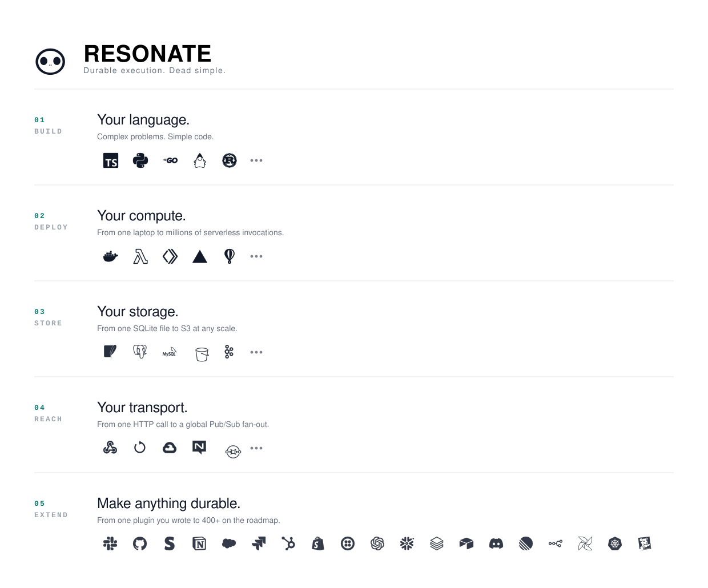

<div align="center">


[](./LICENSE)
[](https://resonatehq.io/discord)
[](https://docs.resonatehq.io/)

[Example](#example) · [Architecture](#architecture) · [Layout](#layout) · [Get started](#get-started) · [Docs](https://docs.resonatehq.io/)

</div>

---

Resonate is a durable execution platform and a durable execution factory,
built on an open, formal specification of distributed async await.

---

## Example

Resonate durable execution is dead simple: durable functions and durable
promises. The example shows a research agent. The research agent accepts a
question, plans searches, fans them out, and synthesizes the results.

```typescript
async function research(context: Context, question: string) {
  // Plan the searches
  // context.run calls a function and persists its result
  const queries = await context.run(agent,
    `Plan the searches for: ${question}`
  );
  // Fan out the searches
  // context.rpc calls a function on another worker, even in another language
  const results = await Promise.allSettled(
    queries.map((q) => context.rpc(search, q))
  );
  // Synthesize the results
  return await context.run(agent,
    `Write a cited report. ${question}: ${results}`
  );
}
```

That is the whole program, location transparent and failure transparent.
The same program can be written in any Resonate-compatible SDK and run on
any Resonate-compatible server.

---

## Architecture

<div align="center">
  <picture>
    <source media="(prefers-color-scheme: dark)" srcset="./impl/server/core/assets/architecture-dark.svg">
    <source media="(prefers-color-scheme: light)" srcset="./impl/server/core/assets/architecture-light.svg">
    
  </picture>
</div>

Resonate sits in the middle of the stack you already run: your language, your
compute, your storage, your transport, and a plugin for everything it does not
natively support yet.

---

## Layout

| | |
|---|---|
| [`spec/`](spec) | The specification: an executable abstract machine in Lean 4, a catalogue of properties every run must satisfy, a TLA+ model, and a trace checker that holds a real server to them |
| [`impl/server/core/`](impl/server/core) | The Resonate server, a single binary |
| [`impl/server/postgres/`](impl/server/postgres) | The Resonate server as one SQL file on Postgres 16+ |
| [`impl/server/s3/`](impl/server/s3) | The Resonate server in Zig, whose only durable state is objects in an S3 bucket |
| [`impl/sdk/ts/`](impl/sdk/ts) | TypeScript SDK |
| [`impl/sdk/py/`](impl/sdk/py) | Python SDK |
| [`impl/sdk/go/`](impl/sdk/go) | Go SDK |
| [`impl/sdk/java/`](impl/sdk/java) | Java SDK |
| [`impl/sdk/rs/`](impl/sdk/rs) | Rust SDK |

SDKs speak the protocol to a server. The server is held to the specification
by recording its traffic and asking the checker whether the abstract machine
can account for it. Each directory has its own README, build, and tests; there
is no root-level build.

---

## Get started

**1. Install the Resonate server and CLI**

```shell
brew install resonatehq/tap/resonate
```

**2. Pick an SDK** and follow its quickstart:
[TypeScript](impl/sdk/ts#quickstart) ·
[Python](impl/sdk/py#quickstart) ·
[Go](impl/sdk/go#quickstart) ·
[Java](impl/sdk/java#quickstart) ·
[Rust](impl/sdk/rs#installation)

**3. Read the docs** at [docs.resonatehq.io](https://docs.resonatehq.io/).

Running on Postgres instead? See [`impl/server/postgres/`](impl/server/postgres).
On nothing but an S3 bucket? See [`impl/server/s3/`](impl/server/s3).

---

## Learn more

- [Evaluate Resonate for your next project](https://docs.resonatehq.io/evaluate/)
- [The concepts that power Resonate](https://www.distributed-async-await.io/)
- [Example application library](https://github.com/resonatehq-examples)

## Community

[Discord](https://resonatehq.io/discord) · [Blog](https://journal.resonatehq.io/subscribe) · [X](https://x.com/resonatehqio) · [LinkedIn](https://www.linkedin.com/company/resonatehqio) · [YouTube](https://www.youtube.com/@resonatehqio)

## License

[Apache-2.0](./LICENSE)

<div align="center">
<sub>Logos are the trademarks of their respective owners and appear here to identify the systems Resonate integrates with.</sub>
</div>
