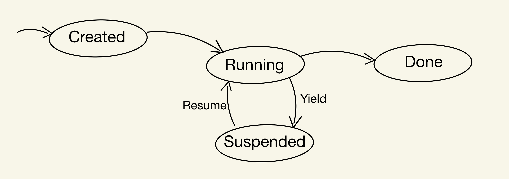

# Architecture


Resonate consists of three subsystems:

- Kernel
- API
- AIO

The Kernel implements cooperative concurrency via coroutines, API and AIO implement preemptive concurrency via goroutines. In other words, the Kernel is single threaded, API and AIO are multi threaded.

The API submits requests to the Kernel via the API Submission Queue, the Kernel submits responses to the API via per-request API Completion Queues. Conversely, the Kernel submits requests to the AIO via per-request-type Submission Queues, the AIO submits responses via the AIO Completion Queue.

## Submission & Completion Queues

The Kernel interacts with the API subsystem and the AIO subsystem via Submission and Completion Queues, implemented as buffered golang channels. A Submission Queue accepts Submission Queue Entries (`SQE`), a Completion Queue accepts Completion Queue Entries (`CQE`). Both `SQE` and `CQE` contain generic parameters `Input` and `Output` as described below,

``` go
type Input interface {
    t_aio.Submission | t_api.Request
}

type Output interface {
    t_aio.Completion | t_api.Response
}
```

Concretely `SQE` and `CQE` is defined as follows,

``` go
type SQE[I Input, O Output] struct {
    *MetaData
    Callback func(...)
    ...
}

type CQE[I Input, O Output] struct {
    *MetaData
    Callback func(...)
    ...
}
```

For every `SQE` within the Kernel, there exists a corresponding `CQE` and the callback and metadata is shared between the two instances.

## Kernel

The Kernel is the control plane of Resonate while the API and the AIO are the data planes of Resonate. The Kernel consists of the Event Loop, the Scheduler and the Coroutine Abstraction.

The accessible API of the kernel is called `System` and has the following functionalities,

``` go
type System struct {
    scheduler *scheduler.Scheduler
    ...
}

func (*System) AddOnRequest(
    kind t_api.Kind, 
    constructor func(...) *scheduler.Coroutine[...]
)
func (*System) Loop() error
func (*System) Shutdown()
func (*System) Tick(...)
```

### The Kernel's Event Loop

The Event Loop takes step every 10ms (we will refer to as `Tick`) and at each step accepts a batch of requests from API. Subsequently for each request, the event loop creates and submits a coroutine to the scheduler. Apart from submitting coroutines to the scheduler, another important function of the event loop's tick is to schedule coroutines (by invoking `scheduler.Tick`).

Initially when the event loop is initialized, the kernel registers coroutine constructors based on the API request type using the `AddOnRequest` function. These constructors are used by the event loop to create the coroutine based on the request type.

`system.Loop` starts the event loop and `system.Shutdown` stops it.

### Scheduler

The scheduler maintains a queue of coroutines to run and at every `scheduler.Tick` two things occur. First, callbacks of any `Completions (CQE)` from AIO are invoked. Second, all coroutines in the queue are _resumed_ sequentially which is where the actual processing of the coroutines occur.

Each coroutine when _resumed_, can _yield_ the control back with a `Submission (SQE)` request that needs to be processed or can run to completion. When the coroutine yields control back, the scheduler submits the corresponding `Submission` to the submission queues of AIO. The callback of the `Submission` adds the coroutine back to the queue. Note that the callback of the corresponding `Completion` are the same. Therefore, when the scheduler in the first step invokes the callback of the `Completion` the coroutine is added back to the queue and subsequently resumed in the same step.

### The Coroutine Abstraction

At the heart of the Resonate Kernel exists the coroutines that process API requests. Using clever synchronization between go's native channels, we implement the standard `Resume` and `Yield` interface of a coroutine. Concretely,

``` go
type Coroutine[I,O any] struct {
    f func(*Coroutine[I,O])
    ...
}

func (*Coroutine[I, O]).Resume(i I, e error) (O, bool)
func (*Coroutine[I, O]).Yield(o O) (I, error)
```

A coroutine can exists in one of 4 states,

1. `Created` when the coroutine is created. This is the initial state in a coroutine's lifecycle
2. `Running` when the scheduler has _resumed_ the coroutine.
3. `Suspended` when the coroutine _yields_ back the control to the scheduler.
4. `Done` when the coroutine runs to completion.

