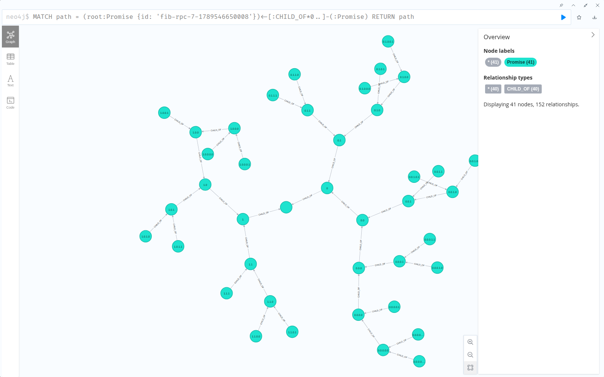

# resonate-server-neo4j

The Resonate server over Neo4j: one node per promise, one edge per await, one
Bolt transaction per transition.

```toml
[servers]
active = "server_neo4j"

[servers.server_neo4j]
uri = "bolt://localhost:7687"
user = "neo4j"
password = "..."
database = "neo4j"   # optional
```

Or `resonate serve --storage-type neo4j --storage-neo4j-uri bolt://localhost:7687 --storage-neo4j-password ...`.
Neo4j 5.x, or 4.4. Community edition is enough: the schema is uniqueness
constraints and range indexes, applied on start (`migrate = true`, the
default; every statement is `IF NOT EXISTS`).

## The graph

| Element | Meaning |
|---|---|
| `(:Promise)` | One promise. The task's columns — `task_state`, `task_version`, `pid`, `ttl`, the retry and lease deadlines — sit on the same node, because a promise runs as a task exactly when it carries a `resonate:target`. |
| `(:Schedule)` | One schedule. `next_run_at` is its queue. |
| `(w)-[:AWAITS {ready: false}]->(p)` | `w` is blocked on `p`: `p`'s `callbacks` entry for `w`. |
| `(w)-[:AWAITS {ready: true}]->(p)` | `p` settled and `w` has not consumed it yet: `w`'s `resumes` entry for `p`. |
| `(c)-[:CHILD_OF]->(p)` | The `resonate:parent` tag, as an edge. Nothing in the protocol reads it. |

Every node also carries `origin` (the id before the first `:`) and `lineage`
(everything after it, `1.2.1`, empty for a root), so a graph tool has a short
caption for a node's place in its tree.

The tag map and both header maps are JSON strings on the node (Neo4j has no
map properties). The tags are also flattened into `tag_kv`, a list of
JSON-encoded `[key, value]` pairs, which is what makes tag containment a
Cypher predicate. The well-known tags are projected into scalar properties —
`origin`, `target`, `parent_id`, `branch_id`, `is_timer`, `external` — the way
the Postgres schema projects them into generated columns.

The deadline queues are predicates over the node, not separate nodes: a
promise deadline is a pending targeted promise, a retry deadline a pending
task, a lease an acquired task. That is the Postgres layout, and it is why the
snapshot this engine reports is byte-identical to the relational engines'.

## Seeing an execution

Open Neo4j Browser (`:7474` on the compose profile), caption the nodes by
their place in the tree, and draw one execution:

```
:style node.Promise { caption: '{lineage}'; color: #1EE3CF; border-color: #17b8a8; text-color-internal: #0b3d3a; diameter: 44px; }
```

```cypher
// One execution, as a tree
MATCH path = (root:Promise {id: 'billing.invoice-1'})<-[:CHILD_OF*0..]-(:Promise)
RETURN path
```



That is `fibonacci.ts --mode=rpc --n=7` from the TypeScript SDK's examples:
forty-one promises, one per recursive call, and the forty `CHILD_OF` edges
that make them a tree.

```cypher
// The same tree, with who is blocked on whom
MATCH path = (root:Promise {id: 'billing.invoice-1'})<-[:CHILD_OF*0..]-(p:Promise)
OPTIONAL MATCH wait = (p)-[:AWAITS]->(:Promise)
RETURN path, wait
```

```cypher
// Every root, newest first
MATCH (r:Promise) WHERE r.id = r.origin
RETURN r.id, r.state, r.created_at ORDER BY r.created_at DESC LIMIT 50
```

Browser colours nodes by label, so a `:Pending` / `:Resolved` secondary label
would colour a live tree by state; this engine does not maintain one yet.

## How a transition runs

Every operation is one transaction, and it begins by *locking* the nodes it
will decide on:

```cypher
MATCH (p:Promise {id: $id}) SET p.rev = p.rev + 1 RETURN p.*
```

Neo4j takes the node's write lock before it evaluates the right-hand side of
that `SET`, and the `RETURN` reads under the lock — `SELECT ... FOR UPDATE`.
The Rust between that read and the writes that follow can therefore reason
about state nothing else is changing, and a settle plus its awaiter fan-out
plus its listener unblocks commit together or not at all. Two transactions
after the same nodes in opposite orders deadlock; Neo4j detects it, the
engine rolls back and retries the transaction once, then answers 503 — the
same path the Postgres engine takes on `40001`.

## What is shared, and what is copied

`engine.rs`, `server.rs`, `deadlines.rs`, `sweep.rs` and `errors.rs` are
byte-for-byte copies of `resonate-server-scylladb`'s; `metrics.rs` differs in
its two metric names. A third copy rather than a shared crate, deliberately,
so the copies can be diffed and any divergence read off:

```sh
for f in engine.rs server.rs deadlines.rs sweep.rs metrics.rs errors.rs; do
  diff crates/resonate-server-scylladb/src/$f crates/resonate-server-neo4j/src/$f
done
```

## Testing

The differential (`diff/differential.rs`) and the console tests (`tests/ui.rs`)
run this engine beside SQLite, the oracle and whatever else is named, through
the twenty-line adapter in `diff/neo4j_adapter.rs`:

```sh
docker run --rm -p 7687:7687 -e NEO4J_AUTH=neo4j/resonate neo4j:5
TEST_NEO4J_URI=bolt://localhost:7687 TEST_NEO4J_PASSWORD=resonate \
  cargo test --release --test differential -- --nocapture
TEST_NEO4J_URI=bolt://localhost:7687 TEST_NEO4J_PASSWORD=resonate \
  cargo test --test ui
```

CI runs both, and the linearizability check, against `neo4j:5`.
