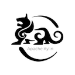
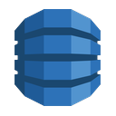
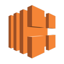
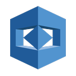
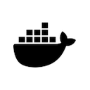
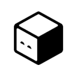
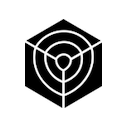

# Resonate Plugins

| | Plugin | Spec | Impl |
|---|---|---|---|
|  | Action Network | [ ] | [ ] |
|  | ActiveCampaign | [ ] | [ ] |
|  | Acuity Scheduling | [ ] | [ ] |
|  | Adalo | [ ] | [ ] |
|  | Affinity | [ ] | [ ] |
|  | Agile CRM | [ ] | [ ] |
|  | Airbyte | [ ] | [ ] |
|  | Airtable | [ ] | [ ] |
|  | Airtop | [ ] | [ ] |
|  | Alibaba AnalyticDB Spark | [ ] | [ ] |
|  | Amazon AppFlow | [ ] | [ ] |
|  | Amazon Athena | [ ] | [ ] |
|  | Amazon Bedrock | [ ] | [ ] |
|  | Amazon Comprehend | [ ] | [ ] |
|  | Amazon ECS | [ ] | [ ] |
|  | Amazon QuickSight | [ ] | [ ] |
|  | Amazon RDS export | [ ] | [ ] |
|  | Amazon Redshift Data API | [ ] | [ ] |
|  | Amazon SageMaker | [ ] | [ ] |
|  | AMQP | [ ] | [ ] |
|  | AMQP Sender | [ ] | [ ] |
|  | Ansible | [ ] | [ ] |
|  | [Apache Airflow](plugins/airflow) | [x] | [x] |
|  | Apache Druid | [ ] | [ ] |
|  | Apache Flink (batch) | [ ] | [ ] |
|  | Apache Kylin | [ ] | [ ] |
|  | Apache Livy | [ ] | [ ] |
|  | Apache Spark | [ ] | [ ] |
|  | Apify | [ ] | [ ] |
|  | APITemplate.io | [ ] | [ ] |
|  | Argo CD | [ ] | [ ] |
|  | Asana | [ ] | [ ] |
|  | AssemblyAI | [ ] | [ ] |
|  | Automation Anywhere | [ ] | [ ] |
|  | Autopilot | [ ] | [ ] |
|  | AWS Batch | [ ] | [ ] |
|  | AWS Certificate Manager | [ ] | [ ] |
|  | AWS CloudFormation | [ ] | [ ] |
|  | AWS CodeBuild | [ ] | [ ] |
|  | AWS Cognito | [ ] | [ ] |
|  | AWS Comprehend | [ ] | [ ] |
|  | AWS DataSync | [ ] | [ ] |
|  | AWS DMS | [ ] | [ ] |
|  | AWS DynamoDB | [ ] | [ ] |
|  | AWS ELB | [ ] | [ ] |
|  | AWS EMR | [ ] | [ ] |
|  | AWS Glue | [ ] | [ ] |
|  | AWS Glue Data Quality | [ ] | [ ] |
|  | AWS HealthLake | [ ] | [ ] |
|  | AWS IAM | [ ] | [ ] |
|  | AWS Lambda | [ ] | [ ] |
|  | AWS MediaConvert | [ ] | [ ] |
|  | AWS Rekognition | [ ] | [ ] |
|  | AWS S3 | [ ] | [ ] |
|  | AWS SES | [ ] | [ ] |
|  | AWS SNS | [ ] | [ ] |
|  | AWS SQS | [ ] | [ ] |
|  | AWS Step Functions | [ ] | [ ] |
|  | AWS Textract | [ ] | [ ] |
|  | AWS Transcribe | [ ] | [ ] |
|  | Azure Batch | [ ] | [ ] |
|  | Azure Container Instances | [ ] | [ ] |
|  | Azure Cosmos DB | [ ] | [ ] |
|  | Azure Data Factory | [ ] | [ ] |
|  | Azure HDInsight | [ ] | [ ] |
|  | Azure Machine Learning | [ ] | [ ] |
|  | Azure Storage | [ ] | [ ] |
|  | Azure Synapse | [ ] | [ ] |
|  | BambooHR | [ ] | [ ] |
|  | [Bannerbear](plugins/bannerbear) | [x] | [x] |
|  | [Baserow](plugins/baserow) | [x] | [x] |
|  | Beeminder | [ ] | [ ] |
|  | BigQuery Data Transfer Service | [ ] | [ ] |
|  | Bitbucket | [ ] | [ ] |
|  | Bitly | [ ] | [ ] |
|  | Bitwarden | [ ] | [ ] |
|  | Blue Prism | [ ] | [ ] |
|  | Botify | [ ] | [ ] |
|  | Box | [ ] | [ ] |
|  | Brandfetch | [ ] | [ ] |
|  | Brevo | [ ] | [ ] |
|  | Bubble | [ ] | [ ] |
|  | Cal.com | [ ] | [ ] |
|  | Calendly | [ ] | [ ] |
|  | Camunda | [ ] | [ ] |
|  | Canonical MAAS | [ ] | [ ] |
|  | Census | [ ] | [ ] |
|  | Chargebee | [ ] | [ ] |
|  | Check Credential Status | [ ] | [ ] |
|  | CircleCI | [ ] | [ ] |
|  | Clearbit | [ ] | [ ] |
|  | Clever Cloud | [ ] | [ ] |
|  | ClickUp | [ ] | [ ] |
|  | Clockify | [ ] | [ ] |
|  | Cloud LRO admin ops | [ ] | [ ] |
|  | Cloudflare | [ ] | [ ] |
|  | CloudQuery | [ ] | [ ] |
|  | Cockpit | [ ] | [ ] |
|  | Coda | [ ] | [ ] |
|  | Coiled | [ ] | [ ] |
|  | CoinGecko | [ ] | [ ] |
|  | Contentful | [ ] | [ ] |
|  | Convert to/from binary data | [ ] | [ ] |
|  | ConvertKit | [ ] | [ ] |
|  | Copper | [ ] | [ ] |
|  | Cortex | [ ] | [ ] |
|  | Cortex (TheHive) | [ ] | [ ] |
|  | CrateDB | [ ] | [ ] |
|  | Currents | [ ] | [ ] |
|  | Customer Datastore (n8n training) | [ ] | [ ] |
|  | Customer Messenger (n8n training) | [ ] | [ ] |
|  | Customer.io | [ ] | [ ] |
|  | Dagger | [ ] | [ ] |
|  | Dagster | [ ] | [ ] |
|  | Data table | [ ] | [ ] |
|  | Databricks | [ ] | [ ] |
|  | DataHub | [ ] | [ ] |
|  | dbt Cloud | [ ] | [ ] |
|  | Debezium (bounded) | [ ] | [ ] |
|  | DebugHelper | [ ] | [ ] |
|  | DeepL | [ ] | [ ] |
|  | Dell PowerStore | [ ] | [ ] |
|  | Demio | [ ] | [ ] |
|  | DHL | [ ] | [ ] |
|  | Discord | [ ] | [ ] |
|  | Discourse | [ ] | [ ] |
|  | Disqus | [ ] | [ ] |
|  | dlt | [ ] | [ ] |
|  | Docker | [ ] | [ ] |
|  | Drift | [ ] | [ ] |
|  | Dropbox | [ ] | [ ] |
|  | Dropcontact | [ ] | [ ] |
|  | E-goi | [ ] | [ ] |
|  | E2E Test | [ ] | [ ] |
|  | Elastic Security | [ ] | [ ] |
|  | Elasticsearch | [ ] | [ ] |
|  | Email Trigger (IMAP) | [ ] | [ ] |
|  | Emelia | [ ] | [ ] |
|  | ERPNext | [ ] | [ ] |
|  | Evaluation | [ ] | [ ] |
|  | Eventbrite | [ ] | [ ] |
|  | Facebook | [ ] | [ ] |
|  | Facebook Ads | [ ] | [ ] |
|  | Facebook Graph API | [ ] | [ ] |
|  | Facebook Lead Ads | [ ] | [ ] |
|  | Figma Trigger (Beta) | [ ] | [ ] |
|  | FileMaker | [ ] | [ ] |
|  | Fivetran | [ ] | [ ] |
|  | Flow | [ ] | [ ] |
|  | Fly.io | [ ] | [ ] |
|  | Form.io | [ ] | [ ] |
|  | Formstack | [ ] | [ ] |
|  | Freshdesk | [ ] | [ ] |
|  | Freshservice | [ ] | [ ] |
|  | Freshworks CRM | [ ] | [ ] |
|  | FTP | [ ] | [ ] |
|  | Function | [ ] | [ ] |
|  | Function Item | [ ] | [ ] |
|  | GCP Cloud DLP | [ ] | [ ] |
|  | GCP Document AI | [ ] | [ ] |
|  | GCP Transcoder | [ ] | [ ] |
|  | GCS Storage Transfer Service | [ ] | [ ] |
|  | GetResponse | [ ] | [ ] |
|  | Ghost | [ ] | [ ] |
|  | Git | [ ] | [ ] |
|  | GitHub | [ ] | [ ] |
|  | GitHub Actions | [ ] | [ ] |
|  | GitLab | [ ] | [ ] |
|  | Gmail | [ ] | [ ] |
|  | Gong | [ ] | [ ] |
|  | Google Ads | [ ] | [ ] |
|  | Google AI Platform | [ ] | [ ] |
|  | Google Analytics | [ ] | [ ] |
|  | Google BigQuery | [ ] | [ ] |
|  | Google Books | [ ] | [ ] |
|  | Google Business Profile | [ ] | [ ] |
|  | Google Calendar | [ ] | [ ] |
|  | Google Campaign Manager | [ ] | [ ] |
|  | Google Chat | [ ] | [ ] |
|  | Google Cloud Batch | [ ] | [ ] |
|  | Google Cloud Build | [ ] | [ ] |
|  | Google Cloud Data Fusion | [ ] | [ ] |
|  | Google Cloud Firestore | [ ] | [ ] |
|  | Google Cloud Natural Language | [ ] | [ ] |
|  | Google Cloud Realtime Database | [ ] | [ ] |
|  | Google Cloud Run | [ ] | [ ] |
|  | Google Cloud Storage | [ ] | [ ] |
|  | Google Contacts | [ ] | [ ] |
|  | Google Dataflow | [ ] | [ ] |
|  | Google Dataform | [ ] | [ ] |
|  | Google Dataplex | [ ] | [ ] |
|  | Google Dataprep | [ ] | [ ] |
|  | Google Dataproc | [ ] | [ ] |
|  | Google Docs | [ ] | [ ] |
|  | Google Drive | [ ] | [ ] |
|  | Google Perspective | [ ] | [ ] |
|  | Google Sheets | [ ] | [ ] |
|  | Google Slides | [ ] | [ ] |
|  | Google Tasks | [ ] | [ ] |
|  | Google Translate | [ ] | [ ] |
|  | Google Vertex AI | [ ] | [ ] |
|  | Google Workflows | [ ] | [ ] |
|  | Google Workspace Admin | [ ] | [ ] |
|  | [Gotify](plugins/gotify) | [x] | [x] |
|  | GoToWebinar | [ ] | [ ] |
|  | Grafana | [ ] | [ ] |
|  | GraphQL | [ ] | [ ] |
|  | Grist | [ ] | [ ] |
|  | Gumroad | [ ] | [ ] |
|  | Hacker News | [ ] | [ ] |
|  | HaloPSA | [ ] | [ ] |
|  | Harvest | [ ] | [ ] |
|  | HashiCorp Nomad | [ ] | [ ] |
|  | Help Scout | [ ] | [ ] |
|  | Hex | [ ] | [ ] |
|  | HighLevel | [ ] | [ ] |
|  | Hightouch | [ ] | [ ] |
|  | Home Assistant | [ ] | [ ] |
|  | HTML Extract | [ ] | [ ] |
|  | HubSpot | [ ] | [ ] |
|  | Humantic AI | [ ] | [ ] |
|  | Hunter | [ ] | [ ] |
|  | IBM i / AS400 | [ ] | [ ] |
|  | iCalendar | [ ] | [ ] |
|  | Intercom | [ ] | [ ] |
|  | Invoice Ninja | [ ] | [ ] |
|  | Iterable | [ ] | [ ] |
|  | Jenkins | [ ] | [ ] |
|  | Jina AI | [ ] | [ ] |
|  | Jira | [ ] | [ ] |
|  | Jira Software | [ ] | [ ] |
|  | Jotform | [ ] | [ ] |
|  | Kafka | [ ] | [ ] |
|  | Keap | [ ] | [ ] |
|  | Kestra | [ ] | [ ] |
|  | KoBoToolbox | [ ] | [ ] |
|  | Kubernetes Jobs | [ ] | [ ] |
|  | Ldap | [ ] | [ ] |
|  | Lemlist | [ ] | [ ] |
|  | Line | [ ] | [ ] |
|  | Linear | [ ] | [ ] |
|  | LingvaNex | [ ] | [ ] |
|  | LinkedIn | [ ] | [ ] |
|  | Liquibase | [ ] | [ ] |
|  | LoneScale | [ ] | [ ] |
|  | Looker | [ ] | [ ] |
|  | Magento 2 | [ ] | [ ] |
|  | Mailcheck | [ ] | [ ] |
|  | Mailchimp | [ ] | [ ] |
|  | Mailchimp campaigns | [ ] | [ ] |
|  | MailerLite | [ ] | [ ] |
|  | Mailgun | [ ] | [ ] |
|  | Mailjet | [ ] | [ ] |
|  | Mandrill | [ ] | [ ] |
|  | Marketstack | [ ] | [ ] |
|  | Matrix | [ ] | [ ] |
|  | Mattermost | [ ] | [ ] |
|  | Mautic | [ ] | [ ] |
|  | Medium | [ ] | [ ] |
|  | MessageBird | [ ] | [ ] |
|  | Metabase | [ ] | [ ] |
|  | Metaplane | [ ] | [ ] |
|  | Microsoft Dynamics CRM | [ ] | [ ] |
|  | Microsoft Entra ID | [ ] | [ ] |
|  | Microsoft Excel | [ ] | [ ] |
|  | Microsoft Excel 365 | [ ] | [ ] |
|  | Microsoft Fabric | [ ] | [ ] |
|  | Microsoft Graph Security | [ ] | [ ] |
|  | Microsoft OneDrive | [ ] | [ ] |
|  | Microsoft Outlook | [ ] | [ ] |
|  | Microsoft SharePoint | [ ] | [ ] |
|  | Microsoft SQL | [ ] | [ ] |
|  | Microsoft Teams | [ ] | [ ] |
|  | Microsoft To Do | [ ] | [ ] |
|  | Mindee | [ ] | [ ] |
|  | MISP | [ ] | [ ] |
|  | Mistral AI | [ ] | [ ] |
|  | Mocean | [ ] | [ ] |
|  | Modal | [ ] | [ ] |
|  | Monday.com | [ ] | [ ] |
|  | MongoDB | [ ] | [ ] |
|  | Monica CRM | [ ] | [ ] |
|  | MQTT | [ ] | [ ] |
|  | MSG91 | [ ] | [ ] |
|  | MySQL | [ ] | [ ] |
|  | [n8n](plugins/n8n) | [x] | [x] |
|  | NASA | [ ] | [ ] |
|  | NetApp ONTAP | [ ] | [ ] |
|  | Netlify | [ ] | [ ] |
|  | Netscaler ADC | [ ] | [ ] |
|  | Nextcloud | [ ] | [ ] |
|  | NocoDB | [ ] | [ ] |
|  | Notion | [ ] | [ ] |
|  | Npm | [ ] | [ ] |
|  | Odoo | [ ] | [ ] |
|  | Okta | [ ] | [ ] |
|  | One Simple API | [ ] | [ ] |
|  | Onfleet | [ ] | [ ] |
|  | OpenAI | [ ] | [ ] |
|  | OpenAI Batch | [ ] | [ ] |
|  | OpenText Operations Orchestration | [ ] | [ ] |
|  | OpenThesaurus | [ ] | [ ] |
|  | OpenWeatherMap | [ ] | [ ] |
|  | Oracle Database | [ ] | [ ] |
|  | Orbit | [ ] | [ ] |
|  | Oura | [ ] | [ ] |
|  | Paddle | [ ] | [ ] |
|  | PagerDuty | [ ] | [ ] |
|  | PayPal | [ ] | [ ] |
|  | PayPal Payouts | [ ] | [ ] |
|  | Peekalink | [ ] | [ ] |
|  | PERIAN | [ ] | [ ] |
|  | Perplexity | [ ] | [ ] |
|  | Phantombuster | [ ] | [ ] |
|  | Philips Hue | [ ] | [ ] |
|  | Pipedrive | [ ] | [ ] |
|  | Plivo | [ ] | [ ] |
|  | PostBin | [ ] | [ ] |
|  | Postgres | [ ] | [ ] |
|  | PostHog | [ ] | [ ] |
|  | Postmark | [ ] | [ ] |
|  | Power BI | [ ] | [ ] |
|  | Prefect | [ ] | [ ] |
|  | ProfitWell | [ ] | [ ] |
|  | Proxmox VE | [ ] | [ ] |
|  | Pushbullet | [ ] | [ ] |
|  | Pushcut | [ ] | [ ] |
|  | Pushover | [ ] | [ ] |
|  | Qovery | [ ] | [ ] |
|  | QuestDB | [ ] | [ ] |
|  | Quick Base | [ ] | [ ] |
|  | QuickBooks Online | [ ] | [ ] |
|  | QuickChart | [ ] | [ ] |
|  | RabbitMQ | [ ] | [ ] |
|  | Raindrop | [ ] | [ ] |
|  | Ray / KubeRay | [ ] | [ ] |
|  | Read Binary File | [ ] | [ ] |
|  | Read Binary Files | [ ] | [ ] |
|  | Read PDF | [ ] | [ ] |
|  | Reddit | [ ] | [ ] |
|  | Redis | [ ] | [ ] |
|  | Redwood RunMyJobs | [ ] | [ ] |
|  | Render | [ ] | [ ] |
|  | Replicate | [ ] | [ ] |
|  | RocketChat | [ ] | [ ] |
|  | RSS Feed | [ ] | [ ] |
|  | [Rundeck](plugins/rundeck) | [x] | [x] |
|  | S3 | [ ] | [ ] |
|  | Salesforce | [ ] | [ ] |
|  | Salesforce Bulk API | [ ] | [ ] |
|  | Salesmate | [ ] | [ ] |
|  | Scrapy | [ ] | [ ] |
|  | SeaTable | [ ] | [ ] |
|  | SecurityScorecard | [ ] | [ ] |
|  | Segment | [ ] | [ ] |
|  | SendGrid | [ ] | [ ] |
|  | Sendy | [ ] | [ ] |
|  | Sentry.io | [ ] | [ ] |
|  | ServiceNow | [ ] | [ ] |
|  | Set | [ ] | [ ] |
|  | seven | [ ] | [ ] |
|  | Shopify | [ ] | [ ] |
|  | Sifflet | [ ] | [ ] |
|  | Sigma | [ ] | [ ] |
|  | SIGNL4 | [ ] | [ ] |
|  | Slack | [ ] | [ ] |
|  | Slurm | [ ] | [ ] |
|  | Snowflake | [ ] | [ ] |
|  | Snowflake SQL API | [ ] | [ ] |
|  | Soda | [ ] | [ ] |
|  | Split In Batches | [ ] | [ ] |
|  | Splunk | [ ] | [ ] |
|  | Splunk search jobs | [ ] | [ ] |
|  | Spotify | [ ] | [ ] |
|  | Spreadsheet File | [ ] | [ ] |
|  | SQLMesh | [ ] | [ ] |
|  | SSE | [ ] | [ ] |
|  | SSH | [ ] | [ ] |
|  | Stackby | [ ] | [ ] |
|  | Storyblok | [ ] | [ ] |
|  | Strapi | [ ] | [ ] |
|  | Strava | [ ] | [ ] |
|  | Stripe | [ ] | [ ] |
|  | Supabase | [ ] | [ ] |
|  | SurveyMonkey | [ ] | [ ] |
|  | SyncroMSP | [ ] | [ ] |
|  | Tableau | [ ] | [ ] |
|  | Taiga | [ ] | [ ] |
|  | Tapfiliate | [ ] | [ ] |
|  | Telegram | [ ] | [ ] |
|  | Temporal | [ ] | [ ] |
|  | Terraform | [ ] | [ ] |
|  | TheHive | [ ] | [ ] |
|  | TheHive 5 | [ ] | [ ] |
|  | Timefold | [ ] | [ ] |
|  | TimescaleDB | [ ] | [ ] |
|  | Todoist | [ ] | [ ] |
|  | Toggl | [ ] | [ ] |
|  | Track Time Saved | [ ] | [ ] |
|  | Travis CI | [ ] | [ ] |
|  | Trello | [ ] | [ ] |
|  | Trivy | [ ] | [ ] |
|  | Twake | [ ] | [ ] |
|  | Twilio | [ ] | [ ] |
|  | Twist | [ ] | [ ] |
|  | Typeform | [ ] | [ ] |
|  | UiPath | [ ] | [ ] |
|  | Unleashed Software | [ ] | [ ] |
|  | Uplead | [ ] | [ ] |
|  | uProc | [ ] | [ ] |
|  | UptimeRobot | [ ] | [ ] |
|  | urlscan.io | [ ] | [ ] |
|  | Veeam | [ ] | [ ] |
|  | Venafi | [ ] | [ ] |
|  | Venafi TLS Protect Cloud | [ ] | [ ] |
|  | Venafi TLS Protect Datacenter | [ ] | [ ] |
|  | Vercel | [ ] | [ ] |
|  | Vero | [ ] | [ ] |
|  | Vonage | [ ] | [ ] |
|  | Webex by Cisco | [ ] | [ ] |
|  | Webflow | [ ] | [ ] |
|  | Weights and Biases Launch | [ ] | [ ] |
|  | Wekan | [ ] | [ ] |
|  | WhatsApp | [ ] | [ ] |
|  | WhatsApp Business Cloud | [ ] | [ ] |
|  | Windmill | [ ] | [ ] |
|  | Wise | [ ] | [ ] |
|  | WooCommerce | [ ] | [ ] |
|  | Wordpress | [ ] | [ ] |
|  | Workable | [ ] | [ ] |
|  | Workflow | [ ] | [ ] |
|  | Write Binary File | [ ] | [ ] |
|  | Wufoo | [ ] | [ ] |
|  | X (Formerly Twitter) | [ ] | [ ] |
|  | Xero | [ ] | [ ] |
|  | Yandex Data Proc | [ ] | [ ] |
|  | Yourls | [ ] | [ ] |
|  | YouTube | [ ] | [ ] |
|  | Zammad | [ ] | [ ] |
|  | Zapier | [ ] | [ ] |
|  | [Zendesk](plugins/zendesk) | [x] | [x] |
|  | Zoho CRM | [ ] | [ ] |
|  | Zoom | [ ] | [ ] |
|  | Zulip | [ ] | [ ] |
